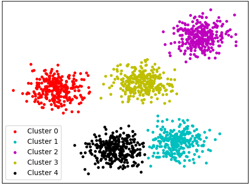

# D-space Vector Clustering
<p align="center">
  
</p>
<br />Implementation of Clustering Algorithms for vectors in D-space, in the three phases Initialization - Assignment - Update. First an input file with all the vectors is given followed by a configuration file. At first, the cluster centres are initialized and then in a loop of Assignment and Update the clusters are formed. Finally a Silhouette Validation Function rates the formation of all clusters. Following are all the algorithms implemented for Initialization, Assignment, Update, Validation.

* **Initialization**:
1. Random selection of k points
2. [K-means++](https://en.wikipedia.org/wiki/K-means%2B%2B)
* **Assignment**:
1. [Lloyd's assignment](https://en.wikipedia.org/wiki/Lloyd%27s_algorithm)
2. Assignment by Range search with LSH
3. Assignment by Range search with Hypercube
<br />Both LSH & Hypercube are implemented [here](https://www.github.com/AndCharalampous/LSH)
* **Update**:
1. [K-means](https://en.wikipedia.org/wiki/K-means_clustering)
2. [Partitioning Around Medoids(PAM)](https://en.wikipedia.org/wiki/K-medoids)

## Deployment

The code was developed and tested on **Linux Ubuntu 18.04 LTS** using **C++11** and **g++ v7.3.0**.

## Prerequisites

A Linux distribution is required with a g++ compiler order to compile and execute. _g++ v7.3.0_ is recommended.
<br />You can check your gcc compiler version using:
<br />``` $ g++ --version ```

You can install the latest gcc compiler on Ubuntu based systems using:
<br />``` $ sudo apt install build-essential ``` 

## Getting Started
Download Repository Locally using:
<br /> ```$ git clone https://github.com/AndCharalampous/lsh.git ```

## Compilation
Compile code using the Makefile provided:
<br /> ```$ cd src```
<br /> ```$ make```
<br /> Executable file cluster is created.

### Configuration File
The format of the configuration must following the convention of <tag>:<int> (without space). The available tags are:
* number_of_clusters
* number_of_hash_functions
* number_of_hash_tables
* max_updates
* hc_probes
* hc_M
<br />_The tags can be given in any order. The number of clusters must be given, all the other tags can be omitted, using the default values_.

### Execution
Execute using:
<br /> ```$ ./cluster [-i input_file] [-c config_file] [-o output_file] [-d metric] [-complete] [-1c]```
* input_file: Path to dataset file
* config_file: Path to configuration file
* output_file: Path to results file
* metric: Metric to be used (1: Euclidean, 2: Cosine)
* complete: If given, the content of clusters will be printed
* 1c: If given only **1c**ombination of algorithms will be used, else all 12 
_All parameters are optional during executing. If not provided, the two files will be requested from user. If no metric is given, then Euclidean is used._

### Output
In output file:
<br />Algorithm: I1A1U1
<br />Metric: Euclidean
<br />
<br />CLUSTER-0 {size: 47 , centroid: -0.055596, 0.0392198, ...
<br />CLUSTER-1 {size: 35 , centroid: 0.0963561, -0.0171738, ...
<br />CLUSTER-2 {size: 52 , centroid: 0.0283769, -0.0649607, ...
<br />....
<br />CLUSTER-149 {size: 51, centroid: .....
<br />
<br />Clustering_time: 85.1298 seconds
<br />Silhouette: (0.0785185, 0.0793203, 0.0499595,...)

## Author
**Andreas Charalampous** - https://github.com/AndCharalampous

## License

This project is licensed under the MIT License - see the [LICENSE.md](LICENSE.md) file for details
